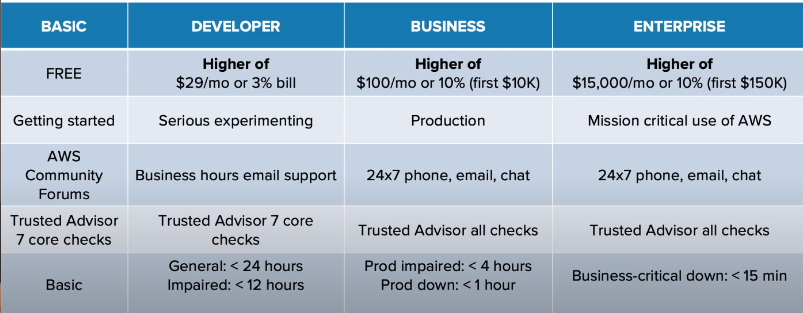

# AWS Certified Cloud Practitioner (CLF-C01) Notes

> Arav Budhiraja | 22nd May 2022

# Outline

- Cloud Concept - 26% 
- Security and Compliance - 25%
- Technology (Deep knowledge about core services and basic overview of a bunch of services) - 33%
- Billing and Pricing - 16%

# What is Cloud Computing?

Practice of using remote servers which are connected to the internet to store, manage and process data. These servers belong to a different organization

The organization owns the servers, hires employees and pays for the property to store the servers 

We pay the organization for the resources we use

# Evolution of Cloud Hosting

- In the earlier days, companies would have 1 physical server which was very expensive, required a lot of maintenance but it offered high privacy

- After that, we had virtual private servers. In this, 1 company would still have 1 physical server but it could be used to run multiple virtual machines thus offering better utilization and isolation

- Then came shared hosting wherein a bunch of companies shared 1 physical server. There would typically be a separate folder for each company It was very cheap but there were a lot of limitations and poor isolation

- Finally came cloud hosting wherein a bunch of virtual machines are running in many physical servers and they can be used by multiple organizations. Flexible, secure, scalable and cost efficient 

# Cloud Service Providers (CSP)

A company which

- Has many cloud services
- The cloud services can be chained together to create an infrastrucure
- Has a single API (AWS API)
- Charge users based on usage per second/minute/hour/second
- Provides a monitoring service (AWS CloudTrail)
- Provides Infrastructure as a Service (IaaS)
- Provides Infrastructure as Code (IaC)

## Examples 

- Tier 1 (Top) - Early to market, well recognized, offer a lot of services - AWS, Azure, GCP, Alibaba Cloud 

- Tier 2 (Mid) - Backed by well known companies, specialize in a particular field, slow - IBM Cloud, Oracle Cloud, Rackspace

- Tier 3 (Light) - Offer virtual private servers and IaaS, simple and cost effective - Linode, Digital Ocean

# Advantages of the Cloud

- Pay on demand: No upfront cost for data centers and servers. You pay for the number of resources you consume per hour/minute/second

- Cost efficient: The cost for 1 physical server is shared between multiple customers. Each customer uses a VM in that server and pays a minimum cost

- Scalability: Easily scale up or down. Delete servers which are not needed. Better than paying for underutilized servers

- Increased speed: Launch resources with few clicks in few minutes

- Stop spending unnecessary money: Focus on customers, development and configuration of apps instead of buying and maintaining hardware

-  Go global: Deploy an app to multiple regions in the entire world with few clicks

- Security: Takes care of physical security and cloud services can be secure by default

- Reliability: Takes care of backups, recovery and replication of data as well as fault tolerance

# Common Cloud Services

The 4 core IaaS services are

- Compute - Virtual computer for running code - Elastic Cloud Computer (EC2)

- Networking - Virtual networks for accessing the internet or isolation between networks - VPC (Virtual Private Cloud) Private Cloud Network 

- Storage - Virtual storage medium such as HDDs or SSDs to store files - Elastic Block Storage (EBS)

- Databases - Virtual database for storing data - Relational Database Service (RDS)

AWS has 200+ cloud services

Other service categories are

- Analytics 
- AR and VR
- Cost Management 
- Blockchain 
- Containers 
- Internet of Things
- Machine Learning
- Robotics
- Satellites 
- Security
- Quantum Computing

# Evolution of Computing

- Dedicated - Physical server owned by a single customer. Only 1 host OS. Not easy to scale and migrate. Multiple apps will struggle to run at the same time. Might overpay if it the server is underutilized. Have to guess capacity. More secure and better isolation

- Virtual Machines - Running multiple virtual computers within a physical computer. These virtual computers borrow a part of resources (CPU, memory, storage) from the physical computer and use that to run. Made possible by a hypervisor. Multiple computers can share a single physical server. Easy to scale and migrate. Multiple apps will struggle to run at the same time

- Containers - A lightweight virtual environment containing our code that quickly runs by using the OS kernel. They typically run within a VM. Multiple apps can run in the same VM

- Functions - Serverless Compute. The CSP manages the containers and VMs.  We upload our code and choose the amount of memory and time it should run for. We pay for the time the code runs for and the VMs only run when code is being executed. Cold start (If a VM takes a long to start) may affect it

# Types of Cloud Computing

![[Pasted image 20220522164856.png]]

- Software as a Service (SaaS): The product is run and managed by the CSP. We do not need to worry about anything and just need to use the product. These are typically for customers. Examples: Gmail, Office

- Platform as a Service (PaaS): Deployment and Management of apps. We do not need to worry about setting up and managing the servers, necessary software and OS. We simply provide our code and it will be deployed. These are typically for developers. Examples:  Heroku, Elastic Beanstalk 

- Infrastructure as a Service (IaaS): Managing the virtual computers, virtual networks, virtual storage and virtual databases. We do not need to worry about the physical hardware, physical networking and physical storage. These are typically for admins. Examples: AWS, Azure

# Deployment Models

- Public Cloud (Cloud First): Everything is built on the CSP. Examples: Data is stored in an RDS database and our app is running on an EC2 VM

- Private Cloud (On Premise): Everything is built on the company's servers in the data center(s)

- Hybrid Cloud: Using both on servers on premise and on servers of a CSP. They are connected via a VPN connection

- Cross Cloud (Multi Cloud): Using services of multiple CSPs 

# Global Infrastructure

Distributed hardware and data centers that are connected by networks and act as 1 large resource to the customer

Consists of 

- Regions (26)
- Availability Zones (84)
- Direction Connection Locations (108)
- Points of Presence (310+)
- Local Zones (17)
- Wavelength Zones (25) 

## AWS Data Centers

AWS uses traditional physical servers, storage and networking equipment 

They bring all of the above together and put it in a building. These buildings are known as data centers

In AWS, the data layer is the place in which users put information into AWS

### Features of AWS Data Centers

- Multiple layers of PHYSICAL SECURITY
- Making sure there is great backup power and fire suppression
- Making sure the data layer is restricted and includes threat detection devices
- When selecting a location for a data center, the environmental issues of the location are taken into consideration

Even if we are going to build a simple web app, we automatically inherit all of the above features, even though we may not need them 

## AWS Availability Zones(AZs)

DATA CENTERS GO INTO AVAILABILITY ZONES

A location consisting of one or more data centers collected together which maybe close to each other are availability zones

Lets us build a fault tolerant and highly available service 

Best practice would be to use more than one AZ

We should put our app into many AZs giving us high bandwidth and low latency such that it feels they are all in 1 data center. If 1 AZ is down, our app will be still be running as the other AZ is up

When launching a resource, we never choose the AZ. Instead we choose a subnet that is associate with the AZ. This can be done in EC2 however in some cases, AWS will manage this for us

Examples: us-east-1a and us-east-1b. us-east-1 is a region and a,b refer to the AZs

### Features of AZs

* Interconnected by high bandwidth, low latency and fault tolerant networks
* All network traffic between AZs is encrypted 
* AZs are physically separated from one another, but are within 60 miles/100km of each other and the latency between them is less than 10ms

As of 2021, there are 80 Availability Zones in the entire world(approx), not in each region

## AWS Regions 

AVAILABILITY ZONES GO INTO REGIONS 

Geographically distinct regions made up of multiple, isolated and physically separated availability zones 

Each region typically has 3 AZs. Not all do, us-east-1 has 6 AZs

Do not depend on each other for power and water supply

SELECT THE REGION WHICH IS CLOSEST TO OUR END USERS 

Allows developers to use the infrastructure that complies with data regulations from a certain part of the word and/or is closest to end user

As of 2022, there are 26 regions(approx). Examples: ap-south-1, us-east-1

us-east-1 (North Virginia) is the first region of AWS and provides access to all services and some services such as billing only work in this region. New services first appear here

Services which can only be found in specific region/regions are called regional services. They cannot be used by all AWS regions. Example: RDS

Services which can be accessed from all regions of the world, be it Mumbai/Virginia/South Africa are called global services. Services such as IAM, CloudFront and S3 have their region set to 'Global' 

S3 as a service is global but the buckets can be setup in different regions 

### Selecting an AWS Region

- Compliance: We have to check if there are regulatory considerations for the data which will be processed

- Services: Are the required AWS services available in that region? AWS DOES NOT PUSH OUT NEW SERVICES TO REGIONS SIMULTANEOUSLY. It tends to roll out services from 1 region to the next and normally starts from North Virginia 

- Geographic Location: Is the region geographically near your intended end users? We should not select the region as Australia if we want our end users to be people from USA/South America/Europe

- Cost: Are we getting the lowest cost of that service in this region? Pricing of the same service varies from region to region

## Diagram

![[Pasted image 20220522194554.png]]

## Point of Presence (PoP)

A location consisting of a data center between an AWS region and end user 

Owned by AWS or a trusted partner 

Used by AWS services which take care of content delivery or upload 

Examples are edge location and regional edge locations

Edge location are data centers holding cached copies of the most frequent data so as to reduce the time it takes for data to reach an end user

Regional edge location are data centers holding large cache copies of least frequent data to reduce the time it takes for data to reach an end user and thus save costs

AWS Service -> Regional Edge Cache -> Edge Location -> End User

Services that use PoPs are

- CloudFront
- Amazon S3 Transfer Acceleration 
- AWS Global Accelerator 

## Direct Connect Locations

Data centers that establish a high bandwidth, low latency connection between your data center/office to AWS

They are owned by trusted partners

AWS Direct Connect is the service that lets us setup a connection between your data center/office to AWS

Helps reduce network costs and increases bandwidth

The options are

1. Lower Bandwidth: 50 MBps-500MBps
2. Higher Bandwidth: 1GBps or 10GBps

B = Bytes and b = bits

## Local Zones

Data centers that are located very close to densely populated areas and provide single digit latency to the area

They are just AZs of regions

First one was in Los Angeles and its AZ is us-west-2-lax-1a

Only specific AWS services can be used in these regions. They are

- EC2
- EBS
- Amazon FSx
- Application Load Balancer
- Amazon VPC

## Wavelength Zones

Allow for edge-computing (bringing the app very close to end users) on 5G networks

Apps running on servers in these zones will have very low latency 

AWS has partnered with various telecommunication companies

Similar to an AZ, a subnet is associated with the wavelength zone

## Data Residency 

Physical location of where an organization or resources reside 

AWS Outposts is a service that lets users store data in a set of physical services 

AWS Config is a policy as code service. Lets us create rules to check AWS resource configuration

IAM policies are written explicitly to deny/allow access to AWS regions

## AWS for Goverments 

Public sector includes public goods and government services

AWS is used by public sectors or organizations which develop workloads for public sectors 

Meets regulatory compliance programs 

It has a service named GovCloud which provides special regions to run workloads for the US government 

GovCloud regions allow customers to store sensitive information

They can only be operated by government employees who are citizens of USA. They are only accessible by US government bodies and root account holders who pass a screening process

GovCloud lets us work with the government of USA

## AWS China

AWS China is completed isolated from AWS Global to meet compliance requirements of the Chinese government

It is a completely different service. The domain is [amazonaws.cn](https://amazonaws.cn)

To work in a region of AWS China, a customer must have a Chinese Business Liecense

Not all services are present such as Route53

There are 2 regions in AWS China

- Ningxia (CN-NorthWest-1)
- Beijing (CN-North-1)

## Sustainability 

- AWS Global Infrastructure powered by renewable energy by 2025
- AWS Global Infrastructure is 3.6 times more energy efficient than US enterprise US data centers
- Evaporative technology to cool data centers
- Recycling water for cooling 
- On site treatment of water to remove minerals and thus reuse water
- Monitor water use for each region

## AWS Ground Station 

A service that lets us control satellite communications, process data and scale up and down without needing to build our own ground station

Used for weather forecasting, communications and video broadcasts

To use it, we schedule a contact (Reserving a satellite). It refers to selecting the satellite, when it should start and end and the ground location to use

Then we use a Ground Station EC2 AMI (OS) to launch an instance that we can use to communicate with the satellite (uplink) and the satellite can communicate with us (downlink). All data from downlink is stored in an S3 bucket

## AWS Outposts 

A service that provides a bunch of physical servers that have access to the same infrastructure, API, services and tools as the ones in AWS 

3 form factors: 42U (A whole new rack of servers), 2U and 1U 

1U and 2U can be placed in existing rack

## Global Network

Connections between the global infrastructure 

Let data flow between data centers very quickly

# Users

## Root 

Your AWS Account

Has complete access to your AWS account

Cannot be deleted. You login as this user via your email and password for the AWS account

NOT an everyday login. We should not always be logging into the root. Root account has unlimited capabilities 

Setup MFA for root account 

To setup MFA, we can use Google Authenticator(software), RSA Tokens(hardware) or Gemalto(hardware)

We need to use root when changing account settings, restoring IAM user permissions, activate IAM access to billing and cost, signing up for GovCloud and closing our account

## IAM user

A user under your AWS account which has a unique username and password

Can access a specific service/services and does not have full access. You login as an IAM user via your AWS account's ID

IAM users will be the users which we will login into everyday. These users can be used by the operations team, security team, database team and developer team.

When creating an IAM user, you specify how the user should access the AWS account

The methods of access are

- Programmatic access: Allows a user to interact with the AWS API via scripts. Provides automation. Requires a unique access key

- AWS Management Console access: Allows a user to access a specific service/services via the AWS website. A user is assigned policies to access services. Requires a password

# AWS Support Plans

A workload is a collection of resources and code that can deliver a profit.

* Determine the support plan needed
* Support options - Basic, Developer, Business and Enterprise

To determine which support plan we have to see what we will be doing in the Cloud

What we can be doing can be from just learning to a mission critical workload 

Mission critical workload - Something in the cloud which is generating profit, which a business depends on. THIS IS NOT A PERSONAL PROJECT. 

## Basic Support 

Aimed at when you are learning about AWS and experimenting and gaining knowledge
 
 Included in ALL AWS ACCOUNTS
 
 - 24/7 access to customer service - Email/Text support. Not gonna get a fast result. Used when asking questions which do not require an immediate result. The support provides documentations, whitepapers and a support forum. 
 - AWS Trusted Advisor - Provides recommendations that help you follow best practices in AWS. Checks for ways to improve your infrastructure, security, performance, reduce costs and monitor service limits. 7 checks only.
 - AWS Personal Health Dashboard: Shows you what is going on in your infrastructure at the moment. 
 - BASIC SUPPORT IS FREE

## Developer Support

Aimed at when a person is working on a project that is going to become a large and real world project. Used when you are testing your project. 

- Response times: For general problems response time is less than 24 hours and for impaired problems it is less than 12 hours. Note: The response time is during business hours. When setting up your AWS account, you have to indicate your region. That regions sets your business hours. 
- Cost: There are two options when it comes to developer support. You will pay the greater of the following 2 options
	-  $29 per month 
	-  3% of the bill
	
	If the 3% of your bill is $50, then you would pay $50 and not $29. If the 3% of your bill is $10, then you would pay $29. 
	
## Business Support 

Aimed at a business which is ready to put a large project into AWS

- Full set of checks with AWS Trusted Advisor
- 24/7 phone, email, chat access to Cloud Support Engineers
- Response times: For impaired problems response time is less than 4 hours and if the project is down, then the response time is less than 1 hour.
- Cost: There are 3 options when it comes to business support. You will pay the greatest of the following 3 options
	-  $100 per month 
	-  10% of the bill, if the bill is less than $10K
	-  10% of $10K + 7% of the bill which is greater than $10K and less than $80K
	
	We will get a greater discount if we use more resources
		
## Enterprise Support

Aimed at large projects whose profit can be measured in seconds

- Response time: If the business is down, response time is less than 15 minutes
- Designated Technical Account Manager who will help when there is a problem in your organization and he/she can give you ideas
- Cost: There are 3 options when it comes to enterprise support. You will pay the greatest of the following 3 options
	-  $15,000 per month 
	-  10% of the bill, if the bill is less than $150K
	-  10% of $150K + 7% of the bill which is greater than $150K and less than $500K

	We will get a greater discount if we use more resources

## Summary

1. Basic: Free and great if you're just starting out
2. Developer: Experimenting with workloads. Little better response time and more access to the systems
3. Business: Running a workload which will generate a profit
4. Enterprise: Run a workload which has to be up and is essential for a business

# Budgets

We set a max budget for our monthly/annual AWS bill and when the limit is crossed, an email is sent via SNS

It also shows us the amount we have used and the forecasted budget

The bill value on which we can keep an eye on is monitored by CloudWatch 

If our bill reaches that limit, CloudWatch will alert us via an email which is sent via SNS

# Billing alarms 

IMPORTANT THING WE CAN ADD TO OUR ACCOUNT 

We should not start a service and leave it running. This will cause the bill to keep on increasing 

Billing alarms watch our account's bill and if we reach a certain spending limit, it will alert us 

An alarm can be created using CloudWatch

CloudWatch will constantly monitor the bill

If our bill reaches that limit, CloudWatch will alert us via an email which is sent via SNS

Billing alarms are rule based alerts which are based on the AWS bill

CREATE MORE THAN ONE ALARM 

If our max allowable bill is $10, we should set alarms at $5, $7 and $9

# Fault Tolerance

A fault domain/failure zone is a section of a network that has been damaged if a critical system fails

Purpose is that if a failure occurs, it will not affect other parts of the network and thus limit the damage

A fault level is a collection of fault domains

With regards to AWS, a region (us-east-1) is the fault level and the AZs (us-east-1a and us-east-1b) are the fault domains

All regions are isolated from one another. All AZs are isolated from one another. Thus there is greatest level of fault tolerance 

However, AZs must not be too far from each other else there will not be low latency. They have their own power supply and generators. Power for different AZs is supplied by different substations. Thus, if 1 AZ fails, it will not affect other AZs

We should put our app into many AZs giving us high bandwidth and low latency such that it feels they are all in 1 data center. If 1 AZ is down, our app will be still be running as the other AZ is up

