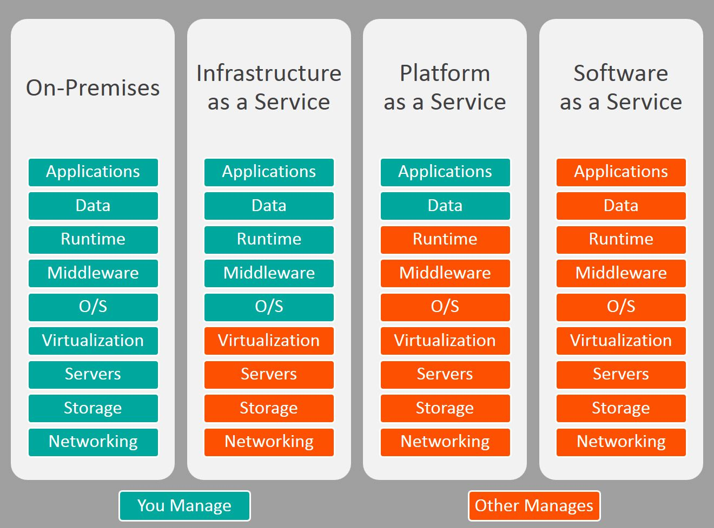
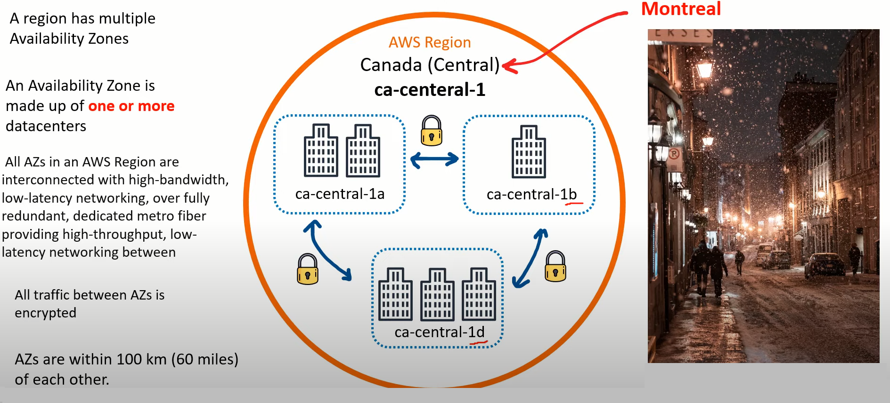
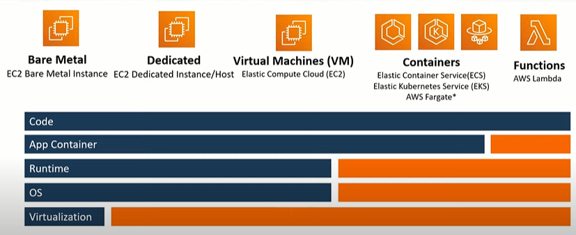

# AWS Certified Cloud Practitioner (CLF-C01) Notes

> Arav Budhiraja | 22nd May 2022

# Outline

- Cloud Concepts - 26% 
- Security and Compliance - 25%
- Technology (Deep knowledge about core services and basic overview of a bunch of services) - 33%
- Billing and Pricing - 16%

# What is Cloud Computing?

Practice of using remote servers which are connected to the internet to store, manage and process data. These servers belong to a different organization

The organization owns the servers, hires employees and pays for the property to store the servers 

We pay the organization for the resources we use

# Evolution of Cloud Hosting

- In the earlier days, companies would have 1 physical server which was very expensive, required a lot of maintenance but it offered high privacy

- After that, we had virtual private servers. In this, 1 company would still have 1 physical server but it could be used to run multiple virtual machines thus offering better utilization and isolation

- Then came shared hosting wherein a bunch of companies shared 1 physical server. There would typically be a separate folder for each company It was very cheap but there were a lot of limitations and poor isolation

- Finally came cloud hosting wherein a bunch of virtual machines are running in many physical servers and they can be used by multiple organizations. Flexible, secure, scalable and cost efficient 

# Cloud Service Providers (CSP)

A company which

- Has many cloud services
- The cloud services can be chained together to create an infrastrucure
- Has a single API (AWS API)
- Charge users based on usage per second/minute/hour/second
- Provides a monitoring service (AWS CloudTrail)
- Provides Infrastructure as a Service (IaaS)
- Provides Infrastructure as Code (IaC)

## Examples 

- Tier 1 (Top) - Early to market, well recognized, offer a lot of services - AWS, Azure, GCP, Alibaba Cloud 

- Tier 2 (Mid) - Backed by well known companies, specialize in a particular field, slow - IBM Cloud, Oracle Cloud, Rackspace

- Tier 3 (Light) - Offer virtual private servers and IaaS, simple and cost effective - Linode, Digital Ocean

# Advantages of the Cloud

- Pay on demand: No upfront cost for data centers and servers. You pay for the number of resources you consume per hour/minute/second

- Cost efficient: The cost for 1 physical server is shared between multiple customers. Each customer uses a VM in that server and pays a minimum cost

- Scalability: Easily scale up or down. Delete servers which are not needed. Better than paying for underutilized servers

- Increased speed: Launch resources with few clicks in few minutes

- Stop spending unnecessary money: Focus on customers, development and configuration of apps instead of buying and maintaining hardware

-  Go global: Deploy an app to multiple regions in the entire world with few clicks

- Security: Takes care of physical security and cloud services can be secure by default

- Reliability: Takes care of backups, recovery and replication of data as well as fault tolerance

# Common Cloud Services

The 4 core IaaS services are

- Compute - Virtual computer for running code - Elastic Cloud Computer (EC2)

- Networking - Virtual networks for accessing the internet or isolation between networks - VPC (Virtual Private Cloud) Private Cloud Network 

- Storage - Virtual storage medium such as HDDs or SSDs to store files - Elastic Block Storage (EBS)

- Databases - Virtual database for storing data - Relational Database Service (RDS)

AWS has 200+ cloud services

Other service categories are

- Analytics 
- AR and VR
- Cost Management 
- Blockchain 
- Containers 
- Internet of Things
- Machine Learning
- Robotics
- Satellites 
- Security
- Quantum Computing

# Evolution of Computing

- Dedicated - Physical server owned by a single customer. Only 1 host OS. Not easy to scale and migrate. Multiple apps will struggle to run at the same time. Might overpay if it the server is underutilized. Have to guess capacity. More secure and better isolation

- Virtual Machines - Running multiple virtual computers within a physical computer. These virtual computers borrow a part of resources (CPU, memory, storage) from the physical computer and use that to run. Made possible by a hypervisor. Multiple computers can share a single physical server. Easy to scale and migrate. Multiple apps will struggle to run at the same time

- Containers - A lightweight virtual environment containing our code that quickly runs by using the OS kernel. They typically run within a VM. Multiple apps can run in the same VM

- Functions - Serverless Compute. The CSP manages the containers and VMs.  We upload our code and choose the amount of memory and time it should run for. We pay for the time the code runs for and the VMs only run when code is being executed. Cold start (If a VM takes a long to start) may affect it

# Types of Cloud Computing



- Software as a Service (SaaS): The product is run and managed by the CSP. We do not need to worry about anything and just need to use the product. These are typically for customers. Examples: Gmail, Office

- Platform as a Service (PaaS): Deployment and Management of apps. We do not need to worry about setting up and managing the servers, necessary software and OS. We simply provide our code and it will be deployed. These are typically for developers. Examples:  Heroku, Elastic Beanstalk 

- Infrastructure as a Service (IaaS): Managing the virtual computers, virtual networks, virtual storage and virtual databases. We do not need to worry about the physical hardware, physical networking and physical storage. These are typically for admins. Examples: AWS, Azure

# Deployment Models

- Public Cloud (Cloud First): Everything is built on the CSP. Examples: Data is stored in an RDS database and our app is running on an EC2 VM

- Private Cloud (On Premise): Everything is built on the company's servers in the data center(s)

- Hybrid Cloud: Using both on servers on premise and on servers of a CSP. They are connected via a VPN connection

- Cross Cloud (Multi Cloud): Using services of multiple CSPs 

# Global Infrastructure

Distributed hardware and data centers that are connected by networks and act as 1 large resource to the customer

Consists of 

- Regions (26)
- Availability Zones (84)
- Direction Connection Locations (108)
- Points of Presence (310+)
- Local Zones (17)
- Wavelength Zones (25) 

## AWS Data Centers

AWS uses traditional physical servers, storage and networking equipment 

They bring all of the above together and put it in a building. These buildings are known as data centers

In AWS, the data layer is the place in which users put information into AWS

### Features of AWS Data Centers

- Multiple layers of PHYSICAL SECURITY
- Making sure there is great backup power and fire suppression
- Making sure the data layer is restricted and includes threat detection devices
- When selecting a location for a data center, the environmental issues of the location are taken into consideration

Even if we are going to build a simple web app, we automatically inherit all of the above features, even though we may not need them 

## AWS Availability Zones(AZs)

DATA CENTERS GO INTO AVAILABILITY ZONES

A location consisting of one or more data centers collected together which maybe close to each other are availability zones

Lets us build a fault tolerant and highly available service 

Best practice would be to use more than one AZ

We should put our app into many AZs giving us high bandwidth and low latency such that it feels they are all in 1 data center. If 1 AZ is down, our app will be still be running as the other AZ is up

When launching a resource, we never choose the AZ. Instead we choose a subnet that is associate with the AZ. This can be done in EC2 however in some cases, AWS will manage this for us

Examples: us-east-1a and us-east-1b. us-east-1 is a region and a,b refer to the AZs

### Features of AZs

* Interconnected by high bandwidth, low latency and fault tolerant networks
* All network traffic between AZs is encrypted 
* AZs are physically separated from one another, but are within 60 miles/100km of each other and the latency between them is less than 10ms

As of 2021, there are 80 Availability Zones in the entire world(approx), not in each region

## AWS Regions 

AVAILABILITY ZONES GO INTO REGIONS 

Geographically distinct regions made up of multiple, isolated and physically separated availability zones 

Each region typically has 3 AZs. Not all do, us-east-1 has 6 AZs

Do not depend on each other for power and water supply

SELECT THE REGION WHICH IS CLOSEST TO OUR END USERS 

Allows developers to use the infrastructure that complies with data regulations from a certain part of the word and/or is closest to end user

As of 2022, there are 26 regions(approx). Examples: ap-south-1, us-east-1

us-east-1 (North Virginia) is the first region of AWS and provides access to all services and some services such as billing only work in this region. New services first appear here

Services which can only be found in specific region/regions are called regional services. They cannot be used by all AWS regions. Example: RDS

Services which can be accessed from all regions of the world, be it Mumbai/Virginia/South Africa are called global services. Services such as IAM, CloudFront and S3 have their region set to 'Global' 

S3 as a service is global but the buckets can be setup in different regions 

### Selecting an AWS Region

- Compliance: We have to check if there are regulatory considerations for the data which will be processed

- Services: Are the required AWS services available in that region? AWS DOES NOT PUSH OUT NEW SERVICES TO REGIONS SIMULTANEOUSLY. It tends to roll out services from 1 region to the next and normally starts from North Virginia 

- Geographic Location: Is the region geographically near your intended end users? We should not select the region as Australia if we want our end users to be people from USA/South America/Europe

- Cost: Are we getting the lowest cost of that service in this region? Pricing of the same service varies from region to region

## Diagram



## Point of Presence (PoP)

A location consisting of a data center between an AWS region and end user 

Owned by AWS or a trusted partner 

Used by AWS services which take care of content delivery or upload 

Examples are edge locations and regional edge cache locations

Edge locations are data centers holding cached copies of the most frequent data so as to reduce the time it takes for data to reach an end user

Regional edge cache locations are data centers holding least frequent data which has been removed from an edge location. It reduces the time it takes for data to reach an end user and thus save costs. They are very close to edge locations 

AWS Service -> Regional Edge Cache -> Edge Location -> End User

Services that use PoPs are

- CloudFront
- Amazon S3 Transfer Acceleration 
- AWS Global Accelerator 

## Direct Connect Locations

Data centers that establish a high bandwidth, low latency connection between your data center/office to AWS

They are owned by trusted partners

AWS Direct Connect is the service that lets us setup a connection between your data center/office to AWS

Helps reduce network costs and increases bandwidth

The options are

1. Lower Bandwidth: 50 MBps-500MBps
2. Higher Bandwidth: 1GBps or 10GBps

B = Bytes and b = bits

## Local Zones

Data centers that are located outside a region and are very close to densely populated areas and provide single digit latency to the area

They are just AZs of regions

First one was in Los Angeles and its AZ is us-west-2-lax-1a

Only specific AWS services can be used in these regions. They are

- EC2
- EBS
- Amazon FSx
- Application Load Balancer
- Amazon VPC

## Wavelength Zones

Allow for edge-computing (bringing the app very close to end users) on 5G networks

Apps running on servers in these zones will have very low latency 

AWS has partnered with various telecommunication companies

Similar to an AZ, a subnet is associated with the wavelength zone

## Data Sovereignty  

Physical location of where an organization or resources reside 

AWS Outposts is a service that lets users store data in a set of physical services 

AWS Config is a policy as code service. Lets us create rules to check AWS resource configuration

IAM policies are written explicitly to deny/allow access to AWS regions

## AWS for Goverments 

Public sector includes public goods and government services

AWS is used by public sectors or organizations which develop workloads for public sectors 

Meets regulatory compliance programs 

It has a service named GovCloud which provides special regions to run workloads for the US government 

GovCloud regions allow customers to store sensitive information

They can only be operated by government employees who are citizens of USA. They are only accessible by US government bodies and root account holders who pass a screening process

GovCloud lets us work with the government of USA

## AWS China

AWS China is completed isolated from AWS Global to meet compliance requirements of the Chinese government

It is a completely different service. The domain is [amazonaws.cn](https://amazonaws.cn)

To work in a region of AWS China, a customer must have a Chinese Business Liecense

Not all services are present such as Route53

There are 2 regions in AWS China

- Ningxia (CN-NorthWest-1)
- Beijing (CN-North-1)

## Sustainability 

- AWS Global Infrastructure powered by renewable energy by 2025
- AWS Global Infrastructure is 3.6 times more energy efficient than US enterprise US data centers
- Evaporative technology to cool data centers
- Recycling water for cooling 
- On site treatment of water to remove minerals and thus reuse water
- Monitor water use for each region

## AWS Ground Station 

A service that lets us control satellite communications, process data and scale up and down without needing to build our own ground station

Used for weather forecasting, communications and video broadcasts

To use it, we schedule a contact (Reserving a satellite). It refers to selecting the satellite, when it should start and end and the ground location to use

Then we use a Ground Station EC2 AMI (OS) to launch an instance that we can use to communicate with the satellite (uplink) and the satellite can communicate with us (downlink). All data from downlink is stored in an S3 bucket

## AWS Outposts 

A service that provides a bunch of physical servers in your data center that have access to the AWS API, services and tools 

3 form factors: 42U (A whole new rack of servers), 2U and 1U 

1U and 2U can be placed in existing rack

## Global Network

Connections between the global infrastructure 

Let data flow between data centers very quickly

# Users

## Root 

Your AWS Account

Has complete access to your AWS account

Cannot be deleted. You login as this user via your email and password for the AWS account

NOT an everyday login. We should not always be logging into the root. Root account has unlimited capabilities 

Setup MFA for root account 

To setup MFA, we can use Google Authenticator(software), RSA Tokens(hardware) or Gemalto(hardware)

We need to use root when changing account settings, restoring IAM user permissions, activate IAM access to billing and cost, signing up for GovCloud and closing our account

## IAM user

A user under your AWS account which has a unique username and password

Can access a specific service/services and does not have full access. You login as an IAM user via your AWS account's ID

IAM users will be the users which we will login into everyday. These users can be used by the operations team, security team, database team and developer team.

When creating an IAM user, you specify how the user should access the AWS account

The methods of access are

- Programmatic access: Allows a user to interact with the AWS API via scripts. Provides automation. Requires a unique access key

- AWS Management Console access: Allows a user to access a specific service/services via the AWS website. A user is assigned policies to access services. Requires a password

# AWS Support Plans

A workload is a collection of resources and code that can deliver a profit.

* Determine the support plan needed
* Support options - Basic, Developer, Business and Enterprise

To determine which support plan we have to see what we will be doing in the Cloud

What we can be doing can be from just learning to a mission critical workload 

Mission critical workload - Something in the cloud which is generating profit, which a business depends on. THIS IS NOT A PERSONAL PROJECT. 

## Basic Support 

Aimed at when you are learning about AWS and experimenting and gaining knowledge
 
 Included in ALL AWS ACCOUNTS
 
 - 24/7 access to customer service - Email/Text support. Not gonna get a fast result. Used when asking questions which do not require an immediate result. The support provides documentations, whitepapers and a support forum. 
 - AWS Trusted Advisor - Provides recommendations that help you follow best practices in AWS. Checks for ways to improve your infrastructure, security, performance, reduce costs and monitor service limits. 7 checks only.
 - AWS Personal Health Dashboard: Shows you what is going on in your infrastructure at the moment. 
 - BASIC SUPPORT IS FREE

## Developer Support

Aimed at when a person is working on a project that is going to become a large and real world project. Used when you are testing your project. 

- Response times: For general problems response time is less than 24 hours and for impaired problems it is less than 12 hours. Note: The response time is during business hours. When setting up your AWS account, you have to indicate your region. That regions sets your business hours. 
- Cost: There are two options when it comes to developer support. You will pay the greater of the following 2 options
	-  $29 per month 
	-  3% of the bill
	
	If the 3% of your bill is $50, then you would pay $50 and not $29. If the 3% of your bill is $10, then you would pay $29. 
	
## Business Support 

Aimed at a business which is ready to put a large project into AWS

- Full set of checks with AWS Trusted Advisor
- 24/7 phone, email, chat access to Cloud Support Engineers
- Response times: For impaired problems response time is less than 4 hours and if the project is down, then the response time is less than 1 hour.
- Cost: There are 3 options when it comes to business support. You will pay the greatest of the following 3 options
	-  $100 per month 
	-  10% of the bill, if the bill is less than $10K
	-  10% of $10K + 7% of the bill which is greater than $10K and less than $80K
	
	We will get a greater discount if we use more resources
		
## Enterprise Support

Aimed at large projects whose profit can be measured in seconds

- Response time: If the business is down, response time is less than 15 minutes
- Designated Technical Account Manager who will help when there is a problem in your organization and he/she can give you ideas
- Cost: There are 3 options when it comes to enterprise support. You will pay the greatest of the following 3 options
	-  $15,000 per month 
	-  10% of the bill, if the bill is less than $150K
	-  10% of $150K + 7% of the bill which is greater than $150K and less than $500K

	We will get a greater discount if we use more resources

## Summary

1. Basic: Free and great if you're just starting out
2. Developer: Experimenting with workloads. Little better response time and more access to the systems
3. Business: Running a workload which will generate a profit
4. Enterprise: Run a workload which has to be up and is essential for a business


# Budgets

We set a max budget for our monthly/annual AWS bill and when the limit is crossed, an email is sent via SNS

It also shows us the amount we have used and the forecasted budget

The bill value on which we can keep an eye on is monitored by CloudWatch 

If our bill reaches that limit, CloudWatch will alert us via an email which is sent via SNS

# Billing alarms 

IMPORTANT THING WE CAN ADD TO OUR ACCOUNT 

We should not start a service and leave it running. This will cause the bill to keep on increasing 

Billing alarms watch our account's bill and if we reach a certain spending limit, it will alert us 

An alarm can be created using CloudWatch

CloudWatch will constantly monitor the bill

If our bill reaches that limit, CloudWatch will alert us via an email which is sent via SNS

Billing alarms are rule based alerts which are based on the AWS bill

CREATE MORE THAN ONE ALARM 

If our max allowable bill is $10, we should set alarms at $5, $7 and $9

# Fault Tolerance

A fault domain/failure zone is a section of a network that has been damaged if a critical system fails

Purpose is that if a failure occurs, it will not affect other parts of the network and thus limit the damage

A fault level is a collection of fault domains

With regards to AWS, a region (us-east-1) is the fault level and the AZs (us-east-1a and us-east-1b) are the fault domains

All regions are isolated from one another. All AZs are isolated from one another. Thus there is greatest level of fault tolerance 

However, AZs must not be too far from each other else there will not be low latency. They have their own power supply and generators. Power for different AZs is supplied by different substations. Thus, if 1 AZ fails, it will not affect other AZs

We should put our app into many AZs giving us high bandwidth and low latency such that it feels they are all in 1 data center. If 1 AZ is down, our app will be still be running as the other AZ is up

# Cloud Architecture Terminologies 

## Solution Architect 

Solves a technical problem by using multiple systems via researching, docs and experimentation 

## Cloud Architect 

A solution architect that finds solutions for tech problems by using cloud services

Must understand these terms

- Availability: Ability to ensure that services are always up and running
- Scalability: Ability to grow rapidly without obstructions 
- Elasticity: Ability to shrink or grow to meet demand 
- Fault Tolerance: Ability to prevent failures 
- Disaster Recovery: Ability to recover from a failure 
- Security: Ability to secure resources
- Costs: Ability to keep bills as low as possible 

## High Availability 

Ability to keep a service available 

Done by ensuring there is no single point of failure and ensure a certain level of performance 

We should put our app into many AZs giving us high bandwidth and low latency such that it feels they are all in 1 data center. If 1 AZ is down, our app will be still be running as the other AZ is up

This can be done by Elastic Load Balancer. Load balancers allow us to evenly distribute the amount of traffic being sent to multiple servers in one or more data centers. If one server/data center, it will forward the traffic to the other server/data center

By default, Elastic Beanstalk and RDS offer high availability 

## High Scalability 

Ability to manually increase/decrease amount of resources (CPU, memory, storage) based on demand in traffic

Vertical Scaling: Scaling up - Upgrading to a better server

Horizontal Scaling: Scaling out - Adding more servers which are similar. Provides high availability 

## High Elasticity 

Ability to automatically increase/decrease amount of resources (CPU, memory, storage) based on demand in traffic

Horizontal Scaling: 

- Scaling out - Adding more servers which are similar. Provides high availability
- Scaling in - Removing underutilized servers which are similar

The service which provides high elasticity in AWS is called Auto Scaling Groups. It will automatically add/remove servers based on rules defined via metrics

## Highly Fault Tolerant 

Ability to ensure that there is no single point of failure for a service

Preventing failures 

Fail-over refers to the process of shifting traffic to an underutilized server when the primary server fails 

RDS Multi-AZ is a service allowing us to run a duplicate database in another AZ in case the primary database fails

## High Durability 

Ability to recover from a disaster and prevent loss of data 

Solution to recover from a disaster is called a disaster recovery

CloudEndure Disaster Recover replicates machines into a low-cost area into a region and thus allows fast recovery in case of failures 

## Business Continuity Plan (BCP)

Document that outlines how a business will operate when there is a disruption in services

Recovery Point Objective -> Max acceptable amount of data that can be lost during a data-loss incident after the last recovery. Expressed as amount of time. How much data are you willing to lose?

Recovery Time Objective -> Max amount of downtime that the business can handle without causing a large financial loss. How much time are you willing to be down for?

## Disaster Recovery Options 

- Back and Restore -> Backup data and bring it back to a new infrastructure. Takes hours. Very cheap
- Pilot Light -> Data is replicated to another region and minimal services are running for this replications. Takes approx 10min. More expensive that backup and restore 
- Warm Standby -> Scaled down version of your infrastructure in another region which would scale up during a disaster. Takes minutes. More expensive than pilot light
- Multi-site Active -> Scaled up version of your infrastructure in another region. Real-time. Most expensive

# AWS API

An application programming interface is a piece of software that facilitates the communication between 2 pieces of software (app/services)

Most common way to communicate with an API is via HTTP or HTTPS requests 

Each service has its own service endpoint to interact with it

Actions are provided via JSON data in the request body 

To communicate with the API you will need to request a temporary token via your credentials 

We communicate with the API via developer tools such as the management console (via a web interface), SDK (via a programming language) or CLI (via a shell)

# AWS Management Console 

Web based interface to build, manage and monitor everything from simple apps to complex deployments 

Click to launch and configure resources

Called "ClickOps" since all operations can be done via few clicks

Each AWS service has its own web based interface to manage it. They are called service consoles. Can be accessed by searching for the service

# AWS Account ID

Every AWS account has a unique 12 digits account ID

Used when logging in via an IAM user or cross account roles or support cases

Good to keep it private

# AWS Tools for PowerShell

PowerShell is an automation and management CLI shell and scripting language 

It is built on top of .NET

AWS Tools for PowerShell allow us to interact with the API via cmdlets (Special commands in the form of Verb-Noun)

If we are not on Windows computer, we can use the AWS CloudShell

Can be instead via this command

```bash
Instead-Module -Name AWS.Tools.Installer
```

Modules for each AWS service can be installed via the `Install-AWSToolsModule` cmdlet

```bash
Install-AWSToolsModule AWS.Tools.EC2,AWS.Tools.S3 -CleanUp
```

# Amazon Resource Name (ARN)

Unique names to identify AWS resources

Use to search for a specific resource

Formats

```txt
arn:type of aws:service:region:account id:resource id
arn:type of aws:service:region:account id:resource type/resource id
arn:type of aws:service:region:account id:resource type:resource id
```

`type of aws`  refers to AWS China (aws-cn), GovCloud (aws-us-gov) or AWS for all others (aws)

`resource id` can be a number or a path such as `s3/bucket` or `ec2/i-373637673673dgdg2t`

# AWS CLI

A CLI is an interface that lets us interact with the OS by typing commands 

A terminal is a program used to send commands to the shell

A console is the physical computer to input information to the terminal

A shell is the program to interprets user commands and executes them and lets us interact with the OS. Examples: bash, zsh, powershell

AWS CLI is a shell that lets us to interact with the AWS API via a CLI

It relies on Python and the program's name is `aws`

# AWS SDK

A software development kit is a collection of tools for software developer that have been bundled into 1 package

AWS SDK is used to interact with the AWS API via programming languages

The IDE we can use in AWS is called Cloud9

Languages supported are

- Java
- Python
- Node JS
- Ruby
- Go
- .NET
- PHP
- JavaScript
- C++

# AWS CloudShell

Browsed based that can be accessed via the management console

Provides 1 GB storage per region

Support bash, zsh and powerful

Can be used in specific regions

# Infrastructure as Code (IaC)

Automates the process of creating, updating or destroying cloud resources by writing code

Following instructions to build infrastructure is full of potential errors 

To solve this problem, we need a way to declare our infrastructure. Instead of installing a web server, we have code which does it. It gives us a language and we say to build 'abcd', 'efgh' and 'ijkl'

If we create an infrastructure using IaC in a development environment we can easily move the code to the test environment and we get the exact same infrastructure without configuring additional settings. 

It is a blue print for our infrastructure 

A collection of resources created with IaC is known as a stack

- AWS CloudFormation (CFN) - Declarative tool. What you write is what you get. More verbose. Supports JSON, YAML
- AWS Cloud Development Kit (CDK) - Imperative tool. You get what you want and rest is filled in. Less verbose. Supports Python

CloudFormation lets us write the code for our resources as JSON or YAML

Once we have the code, we can use CloudFormation to model what we wish to create in AWS. It lets us create, update and delete resources

All of the resources, combined are known as a stack. CloudFormation easily lets us take down the infrastructure for sometime and we can bring it back up easily

CloudFormation is the definitive source for our AWS architecture

# AWS Toolkit for VSCode

Plugin for VSCode to create, debug and deploy AWS resources

1. AWS Explorer -> View resources linked to our account
2. AWS CDK Explorer -> View CDK stacks
3. Amazon Elastic Container Service -> Provides IntelliSense for ECS definition files
4. Serverless Applications -> Create, debug and deploy serverless apps via CFN

# Access Keys

A key and secret required to interact with the AWS API through scripts instead of the management console

Also called AWS credentials

NEVER SHARE THESE WITH ANYONE

You can have 2 access keys active simultaneously and can deactivate them

Access keys are stored in `~/.aws/credentials`

This file consists on profiles to store access keys for multiple users/accounts

The default profile's access keys are used when no profile is specified

Only the root account can generate access keys

# AWS Documentation

Large collection of technical documentation on how to use AWS services

It is open source

Can be found [here](https://docs.aws.amazon.com)

# Shared Responsibility Model

A cloud security model that defines the responsibilities of the customers and the responsibilities of the CSP

Each CSP has a different model but they are more or less the same

The 2 organizations involved are the customer and AWS

AWS is responsible for the physical infrastructure -> Hardware, Global Infrastructure, Networking, Physical Security. They are also responsible for all their services 

Customers are responsible for management and configuration of AWS services or other software -> Their OS, the runtime environment, their code, virtual networks, virtual firewalls. Also responsible for encryption of data, monitoring the environment, the data of the customers and permissions management via IAM

Basically, customers are responsible for everything happening in their cloud environment (data, management, configuration)

AWS is responsible for security of the cloud (hardware, infrastructure)

- On prem -> Customer is responsible for everything since a CSP is not involved

- IaaS -> Customer is responsible for code, customer's data, runtime software, OS and the CSP is responsible for physical storage, networking, servers and also virtualizing the server. Example: AWS

- PaaS -> Customer is responsible for code and customer's data. The CSP is responsible for the OS, runtime software, physical storage, networking, servers and also virtualizing the server. Example: Heroku

- SaaS -> The CSP is responsible for code, customer's data, the OS, runtime software, physical storage, networking, servers and also virtualizing the server. The customer is an end user and so they just have to use the app. Example: MS Word

With regards to compute, the models are

## IaaS

- Bare metal (EC2) -> In bare metals instances, the customer owns an entire physical server and not 1 virtual machine. Customer -> Host OS and hypervisor. AWS -> Physical machine
- Virtual machine (EC2) -> Customer -> Guest OS and containers. AWS -> Host OS, hypervisor, physical machine
- Containers (ECS) -> Customer -> Configuration, deployment and data in containers. AWS -> Host OS, hypervisor, container daemon

## PaaS

AWS Elastic Beanstalk

Customer -> Uploading code, basic configuration, deployment strategy and configuration of 3rd party services used

AWS -> Physical server, OS, networking, storage and security

## SaaS

Amazon WorkDocs 

Customer -> Content and management of documents and configuring sharing

AWS -> Physical server, OS, networking, storage and security

## FaaS

AWS Lambda

Customer -> Uploading code

AWS -> Deployment, container, physical server, OS, networking, storage and security



Orange = AWS and Blue = Customer

# Computing

## EC2

Elastic Cloud Compute

A service that allows us to launch virtual machines

Virtual machines are virtual computers within a physical computer. These virtual computers borrow a part of resources (CPU, memory, storage) from the physical computer and use that to run. Made possible by a hypervisor

Multiple VMs can share a single physical server

When a VM is launched, it is called an instance

Backbone of AWS as a lot of AWS services rely on it (S3, RDS, Lambda)

EC2 allows us to

- Choose CPUs
- Amount of RAM
- Amount of bandwidth
- OS
- Storage mediums

Amazon Machine Image (AMI) is the software part of an instance that contains the guest OS and 3rd party software

## LightSail

A managed service to launch VMs

Can be used to run small and simple apps

Cheaper than EC2

Friendly and easier version of EC2

Does not require much knowledge to use

VM is managed by AWS and we have to manage the app

## Containers

A container is a lightweight virtual environment that quickly runs by using the OS kernel. They contain our code and the software to run it

Elastic Container Service (ECS) can be used to launch Docker containers. It launches containers on multiple EC2 instances which have Docker installed 

Elastic Container Registery (ECR) is the repository which has container images (blueprints). To launch a container, its image needs to be downloaded from ECR

Elastic Kubernetes Service (EKS) is a managed Kubernetes service that is used to manage multiple containers

Clusters are groups of EC2 instances that are running containers which can be managed via EKS or ECS

Serverless services are those in which AWS will manage and configure servers

AWS Fargate is a service that is used to launch containers without the need of servers

AWS Lambda is a service used to run pieces of code without servers. The resource to which a request can be made to run your code is called a function. We simply upload our code, choose the amount of memory it will use and how long it should run for. The code can be ran by making a request to the Lambda function. Charge is based on amount of time code runs for and the number of requests made to the function

## Higher Performance Computing (HPC)

Refers to a group of thousand of servers with fast connections between them to improve performance and efficiency. Clusters are a group of such servers

Nitro System is a combination of dedicated hardware and lightweight hypervisor that gives enhanced security and fast innovation. Used by ECS. Created by AWS

- Nitro Cards -> Special cards for VPC, storage mediums and controller cards
- Nitro Security Chips -> Present in motherboard and protects hardware parts
- Nitro Hypervisor -> Lightweight hypervisor 

Bare Metal Instances are EC2 instances of the entire physical server and not a virtual machine running via a hypervisor. Give max performance and control. They are M5 and R5

Bottlerocket is a Linux OS that is built for running containers on VM or bare metal instances. Created by AWS

AWS ParallelCluster lets us easily deploy and manage HPC clusters on AWS

## Edge and Hybrid Computing

Edge Computing -> Moving workloads outside of our networks to a data center which is close to the destination 

Hybrid Computing -> Ability to run workloads on prem in data centers and in an AWS VPC

AWS Outposts -> A service that provides a bunch of physical servers in your data center that have access to the AWS API, services and tools 

AWS WaveLength -> Allows us to build and deploy apps in a telecommunication data center. Apps have very low latency since communication takes place over a 5G Network which is close to the end user

VMWare Cloud on AWS -> Allows us to manage on prem servers using VMWare. The servers are treated as EC2 instances. They must use VMWare for virtualization

AWS Local Zone -> Data centers that are outside of an AWS region that are close to a highly populated area. Limited services can be used in these data centers

## Cost and Capacity Management of Computing Services

Cost Management -> How to save money?

Capacity Management -> How do we meet demand of increasing traffic through adding/upgrading servers?

How we pay for EC2?

### On Demand 

Pay as you go

You are charged by the hour/second, depending on the OS. 

Most open-source operating systems such as Linux are charged by the second, for a minimum of 1 minute. Windows is charged by the hour

### Reserved Instances(RI)

For a server which will be running for a long time such as 1 year or 3 years 

Changes the billing model to a complete/partial/up front 

In an RI, if we purchase a system, then IT WILL BE A PERMANENT ACTION

RI IS A BILLING MODEL 

AWS offers Standard RIs for 1-year or 3-year terms

### Spot 

Allows us to not spend a tremendous amount of money by bidding on spare Amazon EC2 instances

Up to 90% off compared to On-Demand 

We can only use stateless workloads i.e. we can shutdown the workload and bring it back up and it will not affect the way the workload is running. The data for it is being stored in a database and the workload can make calls to the database to get the data 

These servers can be reclaimed within a 2 minute warning 

Lets say that we are bidding $5 for a server which costs $10. Gradually the price comes down to $5 and now we own that server and we run our workload. As more and more people start using the AWS infrastructure, the price for the server starts coming back up and once it passes $5, we get a 2 minute warning and after 2 minutes our server will be taken away from us 

### Savings Plan

Ways to save on computing price

### AWS Batch 

Plans, schedules and execute batch workloads across all AWS computing services and it will use spot instances to save money

### AWS Compute Optimizer

Suggest ways to reduce costs and improve performance by using ML to analyze previous history

### EC2 AutoScaling Groups (ASGs)

Automatically add/remove EC2 instances to meet the current demand of traffic

Only runs the amount of instances that are required

Helps save money

### Elastic Load Balancer (ELB)

Evenly distributes the amount of traffic being sent to multiple EC2 instances 

If one server is down, it will forward the traffic to the other server

Can forward traffic to EC2 instances in different AZs

### AWS Elastic Beanstalk (EB)

Lets us easily deploy webapps without us having to worry about underlying OS and hardware

We take care of only our code

Example of PaaS

# Storage

- Block Storage - Elastic Block Store (EBS) - Data is split into blocks and the data can be directly accessed by the OS. Persistent storage. When we need a storage medium for an EC2 instance, we use block storage

- File Storage - AWS Elastic File Storage (EFS) - Files are stored in network file shares which can be accessed by multiple authorized clients. Used to share one drive which can be shared by multiple users/EC2 instances. Each file contains data and metadata. We can access the file share via NFS/SMB

- Object Storage - Amazon Simple Storage Service (S3) - Each object contains the data, metadata and a unique ID. There is no storage limit and it scales up automatically. Objects are stored in resources called buckets. If we wish to change the data of an object, we will have to do it offline and then upload the new data to replace the original object. Buckets can be accessed via HTTP or HTTPS

## Elastic Block Storage(EBS)

PERSISTENT STORAGE 

2 flavors: SSDs and Spinning drives aka HDDs 

EBS is a great place to store databases and other long term information 

SSDs are great if you are constantly going to be writing to the disk

If you are not sure about which storage, go for SSD

Spinning drives are great for storing large files and if you want to store files which you do not access frequently 

Supports encryption

CONSIDER THE WORKLOAD BEFORE SELECTING STORAGE TYPE

## S3

Amazon Simple Storage Service

Serverless scalable object storage with virtually not limit 

We do not worry about underlying infrastructure

Data can be upload/accessed via the S3 console

Data is stored as an object. Each object contains a key (name of the object), the data itself, a version ID (version of the object) and metadata (additional info about the object)

Objects are stored in buckets. Buckets may have folders which may hold buckets

Buckets must be globally unique as they have their own domain name

Each object's size can be from 0 bytes to 5 TB

Designed for 99.999% durability

Can be used to host static websites and other static resources such as pictures/videos

Supports encryption via key management service (manual) or its native encryption (decryption is automatic)

- S3 Standard (Default) -> By default all objects are stored in this type. Fast. Replicated across 3 AZs. Ensures high availability and is very durable. Most expensive 

- S3 Intelligent Tiering -> Uses ML to analyze which objects are being frequently used and which are not. Based on this, it will move objects to the most cost efficient tier. Least accessed data maybe sent to a cheaper class in which it takes sometime for data to be retrieved

- S3 Standard Infrequent Access (IA) -> Fast. Cheaper if you rarely access files. You have to pay to retrieve the object. Objects are copied to 3 AZs. However, it is 50% cheaper than Standard with regards to storing data

- S3 One Zone Infrequent Access (IA) -> Fast. Objects exist in only 1 AZ. Ensures high availability. You have to pay to retrieve the object. Data maybe lost if an incident occurs at the data centers in that AZ. Cheaper than Standard IA by 20%

- S3 Glacier -> For long term storage. It takes minutes to hours to retrieve data. Expensive to retrieve data. Very cheap to store data

- S3 Glacier Deep Archive. For long storage. Takes 12 hours to retrieve data. Expensive to retrieve data. Cheap S3 class

## EFS

Managed data store that automatically scales up and down 

We do not have to worry about provisioning more storage in an EFS share as it is automatic

Automatically copies the data across multiple AZs

Using EFS, we can share files inside/outside the cloud, such as sharing the data to a client who is on prem 

Multiple AZs and VPCs can access the same EFS share/shares 

EFS IS NOT SUPPORTED BY WINDOWS, IT ONLY WORKS WITH LINUX 

Mount targets are used to connect to an EFS share from one or more AZs, such that if 1 mount target is down, we can still access the share from the other AZ

Lets say that in our VPC we have 2 AZs, AZ1 and AZ2. Clients in an AZ do not directly connect to an EFS share. Each AZ gets a mount target, and the clients connect to the mount target which would give us access to the data in the EFS share. If we had only 1 mount target and that would go down, we would not be able to access the data. If we lost connection to the mount target from AZ1, we can still connect to the mount target in AZ2

EC2 instances and containers can connect to EFS shares

Machines which are not in our VPC can also connect to an EFS share in our VPC, via a VPN Gateway

EFS has 2 tierings - Standard and Infrequent Access 

Infrequent Access -> To store data which is rarely accessed. It is little more expensive to access, but the cost for storage is less

Standard -> To store data which is constantly being read from/wrritten to

EFS has 2 modes: Regional and One Zone 

Regional automatically copies data across all AZs. One Zone keeps the data in 1 AZ

We can create EFS shares with the same name as the id of the shares is what matters 

We connect to an EFS share by using the NFS(Network File Sharing) protocol

## AWS Snow Family

Storage and computing devices to physically move data into the data or out of the cloud

Used when a internet/direct connection is slow/costly

- Snowball Edge -> Briefcase sized storage devices. 80 TB or 39.5 TB
- Snowcone -> Small versions of Snowball Edge. 8 TB HDD or 14 TB SSD
- Snowmobile -> A truck containing rack of storage mediums that can transfer upto 100 PB

The data from them is delivered to an S3 bucket

Only operates in USA

## Hybrid cloud storage

Storage Gateway ->  Extends on prem storage to AWS

File Gateway -> Extends local storage to an S3 bucket

Volume Gateway -> Copies contents local drives to an S3 bucket so that files are backed up

Tape Gateway -> Stores files on virtual taps for backing them up. Cost effective. For long term storage

## AWS Backup

A managed backup service that makes it easy to automate backing up of data across multiple AWS services

## CloudEndure Disaster Recovery

Continuously replicates machines into a low-cost area into a region and thus allows fast recovery in case of failures 

## Amazon FSx 

Highly performant distributed file systems that can be accessed by Windows hosts via SMB and Linux hosts via Lustre

Amazon FSx for Windows File Server communicates with a Windows host using the SMB protocol and can be used to mount an FSx share to the host

Amazon FSx for Lustre communicates with a Linux hosts using the Lustre protocol and can be used to mount an FSx share to the host

# Databases

A collection of organized and structured data than can be easily accessed and managed 

Types

- Relational: Structured data stored in tables, rows and columns. Tables are related to one another as they might share some data
- Non Relational: Data stored in different formats (XML, JSON, Graphs). Good for horizontal scaling

Special language is used to retrieve/update data

## Data Warehouse

Set of large data (terabytes) which is stored in rows and columns and is used for analysis by preparing reports, graphs

They perform aggregation (grouping) and are optimized around columns

They can perform operations very quickly

Meant for infrequent access and so not used for real time reporting

Consumes data from another relational database

## Key-Value Database

Type of non relational database used to store key-value pairs of data

Fast

Lack relationships, indexes, grouping 

It represents a dictionary 

Can scale beyond relational databases

## Document Database

Type on non relational database that stores documents

Documents refer to a collection of data in JSON/XML format

Type of key-value database with extra features

Tables = Collection

Rows = Documents

Columns = Fields

## NoSQL Database Services

DynamoDB -> Serverless high performance NoSQL key-value and document database. Can store billions of records. Can be scaled to a great extent. Single digit millisecond read latency. The more pressure we put on it, the more queries continue, the faster it is.  No management required. Cost effective. Can be made faster using DynamoDB Accelerator(DAX). It is a caching server that sits in front of DynamoDB which has sub millisecond read latency

DocumentDB -> NoSQL document database. It is very similar to MongoDB

Amazon Keyspaces -> Managed Apache Cassandra database. NoSQL key-value database. 

## Relational Database Services

Relational Database Service (RDS) -> Allows us to create fully managed relational databases using various data management systems. Patching, replication, backups, tuning, monitoring and high availability are handled by AWS. Supports MySQL, PostgreSQL, MSSQL, MariaDB, Oracle Database, Aurora. The database runs on an EC2 instance which is not managed by us. Cannot automatically scale in/out

Aurora -> Amazon's purpose built, cloud focused database. 5x faster than MySQL and 3x faster than PostgreSQL. Durable, scalable, secure and highly available

Aurora Serverless -> Serverless version of Aurora. Cheaper. Cold start affects it

RDS On VMware -> Allows to deploy the RDS supported data management systems on an on prem server/data center. The server/data center must be using VMware for virtualization. Database is still managed by RDS

## Others

Redshift -> Managed data warehouse than can store peta bytes of data that is supposed to be stored for a long time. Grabs data from an S3 bucket. Expensive. Fast. Complex queries can be executed. Used to store data which is used for generating analytics/report. Data can be sent to Amazon QuickSight (Used to create beautiful reports about data)

ElastiCache -> Managed database of an in-memory and caching databases such as Redis and Memcached 

Neptune -> Managed graph database. Data is represented as graphs

Amazon Timestreams -> Managed time series database. Used to measure how data changes over time

Amazon Quantum Ledger Database -> Managed ledger database that provides transport, unchangeable and cryptographically different transaction logs

Database Migration Service (DMS) -> Used to migrate data from an on prem database to an AWS database, two databases in the same/different account using different database management systems or from a relational to a non relational database. Lets say we have a database on prem which we want to shift to the cloud using DMS. If people are constantly writing to that database, DMS will still continue to push data to the cloud